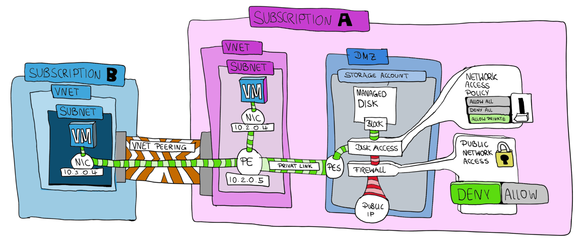

# Azure Backup 

## immutability test

~~~bash
sudo hwclock -s
sudo ntpdate time.windows.com
prefix=cptdazbackup
location=germanywestcentral
az group create -n $prefix -l $location
az deployment group create -g $prefix -w -n $prefix -p prefix=$prefix location=$location -f vault.bicep
~~~

## azure disk & snapshot copy protection

usefull links:
- [how to get it done with bicep](https://stackoverflow.com/questions/68385774/how-to-set-os-disks-networking-to-allowprivate-private-endpoint-through-disk)
- [protect os disk issue](https://github.com/Azure/azure-rest-api-specs/issues/21325)

### Azure Disk & Snapshot Copy Protection

The networkAccessPolicy and publicNetworkAccess properties of an Azure Disk control how the disk can be accessed over the network.

networkAccessPolicy: This property can have one of three values:
 1. AllowAll: The disk can be accessed from all networks.
 2. DenyAll: The disk cannot be accessed from any network.
 3. AllowPrivate: The disk can only be accessed from a specific subnet in a virtual network. This is achieved by associating the disk with a DiskAccess resource that is linked to the subnet.

(source: https://learn.microsoft.com/en-us/rest/api/compute/disks/create-or-update?view=rest-compute-2023-04-02&tabs=HTTP#networkaccesspolicy)

publicNetworkAccess: This property can have one of two values:
 1. Enabled: The disk can be accessed from the public internet.
 2. Disabled: The disk cannot be accessed from the public internet.

Sometimes one picture says more than 1000 words, so maybe the following picture helps to understand the concept of Azure Disk & Snapshot Copy Protection

### Test Cases
We will run through several SAS Copy cases which tries to cover all possible variations of how to configure snapshot network access policy in a table

Environment:
~~~mermaid
classDiagram 
vnet1-->vnet2: peering
vnet1-->vnet3: peering
vnet1: Subscription1
vnet1: vm1 10.1.0.4
vnet1: PE 10.1.0.5
vnet1: diskAccessObject
vnet1: disk1
vnet2: Subscription1
vnet2: vm1 10.2.0.4
vnet3: Subscription2
vnet3: vm1 10.3.0.4
~~~

| Case | Source | Subscription | Destination | networkAccessPolicy | publicNetworkAccess |Disk Access Resource | Private Endpoint | HTTP Result |
| --- | --- | --- | --- | --- | --- | --- | --- | --- |
| 1 | vm2SnapId | sub1 | local PC | AllowPrivate | Disable | vm2DiskAccess1Id | vm2pe1Id | 403 |
| 2 | vm2SnapId | sub1 | vm1 | AllowPrivate | Disable | vm2DiskAccess1Id | vm2pe1Id | 200 |
| 3 | vm2SnapId | sub2 | vm3 | AllowPrivate | Disable | vm2DiskAccess1Id | vm2pe1Id | 200 |

### Create Azure Resources with Azure Bicep Resource Templates and Azure CLI
~~~bash
# Define prefix and suffix for all azure resources
prefix=cptdazdisk2 # replace sm with your own prefix
location=germanywestcentral
currentUserObjectId=$(az ad signed-in-user show --query id -o tsv)
adminPassword='demo!pass123!'
adminUsername='chpinoto'
# Create Azure Resources with Azure Bicep Resource Templates and Azure CLI 
az deployment mg create -m myedge -l $location --template-file ./diskaccess/deploy.bicep --parameters hubSubscriptionId=f474dec9-5bab-47a3-b4d3-e641dac87ddb spokeSubscriptionId=a2c4c615-592b-46a7-b30f-54ccd174bddf prefix=$prefix currentUserObjectId=$currentUserObjectId
~~~

### Verify deployment

~~~bash
# list all vnets which are linked to the private DNS zone
az network private-dns link vnet list -g $prefix --zone-name "privatelink.blob.core.windows.net" --query "[].{name:name, virtualNetwork:virtualNetwork.id}" | sed 's|/subscriptions/.*/providers||g'
~~~

~~~json
[
  {
    "name": "dnslink-to-cptdazdisk1",
    "virtualNetwork": "/Microsoft.Network/virtualNetworks/cptdazdisk1"
  },
  {
    "name": "dnslink-to-cptdazdisk2",
    "virtualNetwork": "/Microsoft.Network/virtualNetworks/cptdazdisk2"
  },
  {
    "name": "dnslink-to-cptdazdisk3",
    "virtualNetwork": "/Microsoft.Network/virtualNetworks/cptdazdisk3"
  }
]
~~~

### Verify if private access is enabled for Disk1

~~~bash
# Get the disk ID which will be used during the snapshot creation
disk1Id=$(az disk show -g $prefix -n ${prefix}1 --query id -o tsv)
# Lookup the disk access details
az disk show --ids $disk1Id --query '{publicNetworkAccess:publicNetworkAccess, networkAccessPolicy:networkAccessPolicy, diskAccessId:diskAccessId}'| sed 's|/subscriptions/.*/providers||g'
~~~

Output should look as follow:

~~~json
{
  "diskAccessId": "/Microsoft.Compute/diskAccesses/cptdazdiskvm2diskaccess1",
  "networkAccessPolicy": "AllowPrivate",
  "publicNetworkAccess": "Disabled"
}
~~~

# Prepare testing by creating a snapshot from disk1

Create the snapshot from disk1 with private link enabled

~~~bash
# Get the disk access resource id which will be used during the snapshot creation
diskAccessId=$(az disk-access show -n $prefix -g $prefix --query id -o tsv)
# Create the snapshot
disk1SnapId=$(az snapshot create -g $prefix -n ${prefix}vm1snap --source $disk1Id --incremental true --sku Standard_ZRS --network-access-policy AllowPrivate --public-network-access Disabled --disk-access $diskAccessId --query id -o tsv)
# Show the snapshot access details
az snapshot show --ids $disk1SnapId --query '{publicNetworkAccess:publicNetworkAccess, networkAccessPolicy:networkAccessPolicy, diskAccessId:diskAccessId}' | sed 's|/subscriptions/.*/providers||g'
~~~

Output should look as follow:

~~~json
{
  "diskAccessId": "/Microsoft.Compute/diskAccesses/cptdazdiskvm2diskaccess1",
  "networkAccessPolicy": "AllowPrivate",
  "publicNetworkAccess": "Disabled"
}
~~~

### [CASE1] Download Snapshot from my local PC

~~~bash
disk1SnapSASUrlLocalPC=$(az snapshot grant-access --ids $disk1SnapId --duration-in-seconds 3600 --query accessSas -o tsv) # HTTP 200 running VM
# extract hostname from SAS URL
disk1SnapSASUrlLocalPCFQDN=$(echo $disk1SnapSASUrlLocalPC | sed 's|https://||g' | sed 's|/.*||g')
echo $disk1SnapSASUrlLocalPCFQDN
dig $disk1SnapSASUrlLocalPCFQDN # public IP
curl -o /dev/null -s -w "%{http_code}\n" -I $disk1SnapSASUrlLocalPC # HTTP 403
~~~

### [CASE2] Download Snapshot from VM2 peered with VNET1 where the private link is deployed

~~~bash
# login to the VM
vm2Id=$(az vm show -g $prefix -n ${prefix}2 --query id -o tsv)
az network bastion ssh -n $prefix -g $prefix --target-resource-id $vm2Id --auth-type AAD

# install azure cli
curl -sL https://packages.microsoft.com/keys/microsoft.asc | gpg --dearmor | sudo tee /etc/apt/trusted.gpg.d/microsoft.gpg > /dev/null
AZ_REPO=$(lsb_release -cs)
echo "deb [arch=amd64] https://packages.microsoft.com/repos/azure-cli/ $AZ_REPO main" | sudo tee /etc/apt/sources.list.d/azure-cli.list
sudo apt-get update
sudo apt-get install azure-cli -y

# login with managed identity of VM2
az login --identity

# inside the vm we need to setup the environment variables again.
prefix=cptdazdisk
# retrieve the disk access resource id
vm1SnapId=$(az snapshot show -g $prefix -n ${prefix}vm1snap --query id -o tsv)
# Verify snapshit access policy to allow private access only
az snapshot show --ids $vm1SnapId --query '{publicNetworkAccess:publicNetworkAccess, networkAccessPolicy:networkAccessPolicy, diskAccessId:diskAccessId}'| sed 's|/subscriptions/.*/providers||g'
~~~

Output should look as follow:
~~~json
{
  "diskAccessId": "/Microsoft.Compute/diskAccesses/cptdazdiskvm2diskaccess1",
  "networkAccessPolicy": "AllowPrivate",
  "publicNetworkAccess": "Disabled"
}
~~~

Download via SAS URL

~~~bash
disk1SnapSASUrlVM2=$(az snapshot grant-access --ids $vm1SnapId --duration-in-seconds 3600 --query accessSas -o tsv) # HTTP 200 running VM
# extract hostname from SAS URL
disk1SnapSASUrlVM2FQDN=$(echo $disk1SnapSASUrlVM2 | sed 's|https://||g' | sed 's|/.*||g')
echo $disk1SnapSASUrlVM2FQDN
dig $disk1SnapSASUrlVM2FQDN # private IP 10.1.0.5
curl -o /dev/null -s -w "%{http_code}\n" -I $disk1SnapSASUrlVM2 # HTTP 200
logout
~~~

### [CASE3] Download Snapshot from VM3 (different Subscription) peered with VNET2 where the private link is deployed

~~~bash
# switch subscription
az account set --subscription "sub-myedge-02"
# log into the VM1
vm3Id=$(az vm show -g $prefix -n ${prefix}3 --query id -o tsv)
# switch subscription
az account set --subscription "sub-myedge-01"
az network bastion ssh -n $prefix -g $prefix --target-resource-id $vm3Id --auth-type AAD

# install azure cli
curl -sL https://packages.microsoft.com/keys/microsoft.asc | gpg --dearmor | sudo tee /etc/apt/trusted.gpg.d/microsoft.gpg > /dev/null
AZ_REPO=$(lsb_release -cs)
echo "deb [arch=amd64] https://packages.microsoft.com/repos/azure-cli/ $AZ_REPO main" | sudo tee /etc/apt/sources.list.d/azure-cli.list
sudo apt-get update
sudo apt-get install azure-cli -y

az login --identity # use the VM identity instead of the user identity
# inside the vm we need to setup the environment varaibles again.
prefix=cptdazdisk
# switch subscription
az account set --subscription "sub-myedge-01"
# retrieve the disk access resource id
vm1SnapId=$(az snapshot show -g $prefix -n ${prefix}vm1snap --query id -o tsv)
disk1SnapSASUrlVM3=$(az snapshot grant-access --ids $vm1SnapId --duration-in-seconds 3600 --query accessSas -o tsv) # HTTP 200 running VM
# extract hostname from SAS URL
disk1SnapSASUrlVM3FQDN=$(echo $disk1SnapSASUrlVM3 | sed 's|https://||g' | sed 's|/.*||g')
echo $disk1SnapSASUrlVM3FQDN
dig $disk1SnapSASUrlVM3FQDN # private IP 10.2.0.5
curl -o /dev/null -s -w "%{http_code}\n" -I $disk1SnapSASUrlVM3 # HTTP 200
logout
~~~

### In case you like to create disk access resource and private endpoint manually

~~~bash
# Create a disk access resource which will be used to secure the snapshot by private link
az disk-access create -n ${prefix}vm2diskaccess1 -g $prefix -l $location
# Get the disk access resource id which will be used during the snapshot creation
diskAccess=$(az disk-access show -n ${prefix}vm2diskaccess1 -g $prefix --query id -o tsv)
# Create a private endpoint for the disk access object
az network private-endpoint create -g $prefix --name ${prefix}vm2pe1 --vnet-name ${prefix}2 --subnet ${prefix}2 --private-connection-resource-id $diskAccess --group-ids disks --connection-name ${prefix}vm2pecon1
vm2pe1Id=$(az network private-endpoint show -g $prefix --name ${prefix}vm2pe1 --query id -o tsv)
# Create a private DNS zone for the disk access object
az network private-dns zone create -g $prefix --name "privatelink.blob.core.windows.net"
# Assign pdns to vnet1
az network private-dns link vnet create -g $prefix --zone-name "privatelink.blob.core.windows.net" --name ${prefix}1dnslink1 --virtual-network ${prefix}1 --registration-enabled false
# Assign pdns to vnet2
az network private-dns link vnet create -g $prefix --zone-name "privatelink.blob.core.windows.net" --name ${prefix}2dnslink1 --virtual-network ${prefix}2 --registration-enabled false
# switch subscription
az account set --subscription "sub-myedge-01"
# Assign pdns to vnet3 in a different subscription
vnet3Id=$(az network vnet show -g $prefix -n ${prefix}3 --query id -o tsv)
# switch subscription
az account set --subscription "vse-sub"
az network private-dns link vnet create -g $prefix --zone-name "privatelink.blob.core.windows.net" --name ${prefix}3dnslink1 --virtual-network $vnet3Id --registration-enabled false
# Assing the private endpoint to the private DNS zone via an dns-zone-group
az network private-endpoint dns-zone-group create -g $prefix --endpoint-name ${prefix}vm2pe1 --name ${prefix}2 --private-dns-zone "privatelink.blob.core.windows.net" --zone-name disks
# list all vnets which are linked to the private DNS zone
az network private-dns link vnet list -g $prefix --zone-name "privatelink.blob.core.windows.net" --query "[].{name:name, virtualNetwork:virtualNetwork.id}" | sed 's|/subscriptions/.*/providers||g'
~~~

Output should look as follow:

~~~json
[
  {
    "name": "cptdazdisk1dnslink1",
    "virtualNetwork": "/Microsoft.Network/virtualNetworks/cptdazdisk1"
  },
  {
    "name": "cptdazdisk2dnslink1",
    "virtualNetwork": "/Microsoft.Network/virtualNetworks/cptdazdisk2"
  },
  {
    "name": "cptdazdisk3dnslink1",
    "virtualNetwork": "/Microsoft.Network/virtualNetworks/cptdazdisk3"
  }
]
~~~

## Misc

### Azure CLI

~~~bash
currentUserObjectId=$(az ad signed-in-user show --query id -o tsv)
echo $currentUserObjectId
subid=$(az account show --query id -o tsv)
scope=/subscriptions/${subid}/resourceGroups/${prefix}
echo $scope
az role assignment list --scope $scope --query "[].{principalName:principalName, roleDefinitionName:roleDefinitionName}" -o table
# delete all role assignments under a certain scope
az role assignment delete -h --scope $scope --assignee $currentUserObjectId

# Find multiple RBAC role actions in standard roles
az role definition list --query "[?contains(permissions[].actions[], 'Microsoft.Compute/disks/write') || contains(permissions[].actions[], 'Microsoft.Compute/disks/*') && (contains(permissions[].actions[], 'Microsoft.Compute/diskAccesses/read') || contains(permissions[].actions[], 'Microsoft.Compute/diskAccesses/*'))].{roleName:roleName, id:id}"

 -o json | jq -r '.[]'

az role definition list --query "[?contains(permissions[].actions[], 'Microsoft.Compute/disks/write')].{roleName:roleName, id:id}"

az role definition list --query "[?contains(permissions[].actions[], 'Microsoft.Compute/disks/write') && contains(permissions[].actions[], 'Microsoft.Compute/diskAccesses/read')].{roleName:roleName, id:id}"

 -o json | jq -r '.[]'

az role definition list --query "[?contains(permissions[].actions[], 'Microsoft.Compute/disks/write') && contains(permissions[].actions[], 'Microsoft.Compute/diskAccesses/read')].{roleName:roleName, id:id}" -o json | jq -r '.[]'

~~~
### Git

~~~bash

git init main
gh repo create cptdazbackup --public
git remote add origin https://github.com/cpinotossi/cptdazbackup.git
git status
git add .
git commit -m"init"
git push origin main

git tag //list local repo tags
git ls-remote --tags origin //list remote repo tags
git fetch --all --tags // get all remote tags into my local repo
git log --oneline --decorate // List commits
git log --pretty=oneline //list commits
git tag -a v2 b20e80a //tag my last commit

git checkout v1
git switch - //switch back to current version
co //Push all my local tags
git push origin <tagname> //Push a specific tag
git commit -m"not transient"
git tag v1
git push origin v1
git tag -l
git fetch --tags
git clone -b <git-tagname> <repository-url> 
~~~